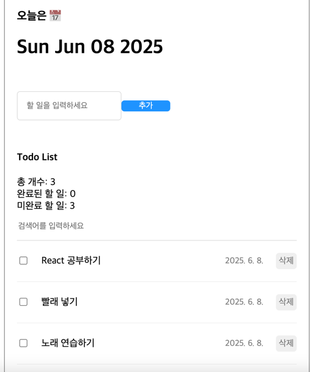

# ✅ React Todo App (with Context API)

이 프로젝트는 React의 Context API와 useReducer를 활용한 **할 일 관리(Todo List)** 애플리케이션입니다.  
컴포넌트 간 상태 공유를 위해 props 대신 Context를 사용해 구조를 단순화했습니다.

---

## 🛠️ 주요 기술 스택

- **React**
- **Context API**
- **useReducer / useRef / useCallback**
- **Vanilla CSS (모듈화됨)**

---

## ✨ 기능 소개

- ✅ 새 할 일 등록
- ✅ 할 일 완료 체크/해제 (토글)
- ✅ 할 일 삭제
- ✅ 총 개수 / 완료 / 미완료 통계
- ✅ 키워드 검색
- ✅ 날짜 표시 (`createDate` → `YYYY. M. D.` 형식)

---

## 📂 폴더 구조

---

## 📸 데모 화면

| 메인 화면 |
|-----------|
| |

---

## 🧩 설치 및 실행

\`\`\`bash
git clone https://github.com/your-username/react-context-todo.git
cd react-context-todo
npm install
npm start
\`\`\`

---

## 💡 향후 개선 아이디어

- ✅ 로컬 스토리지에 저장
- ✅ 수정 기능 추가
- ✅ 우선순위/카테고리/마감일 도입
- ✅ Typescript 마이그레이션

---

## 👩‍💻 제작자

- **Your Name (lucyeipstein)**  
- GitHub: [@your-username](https://github.com/your-username)

---
